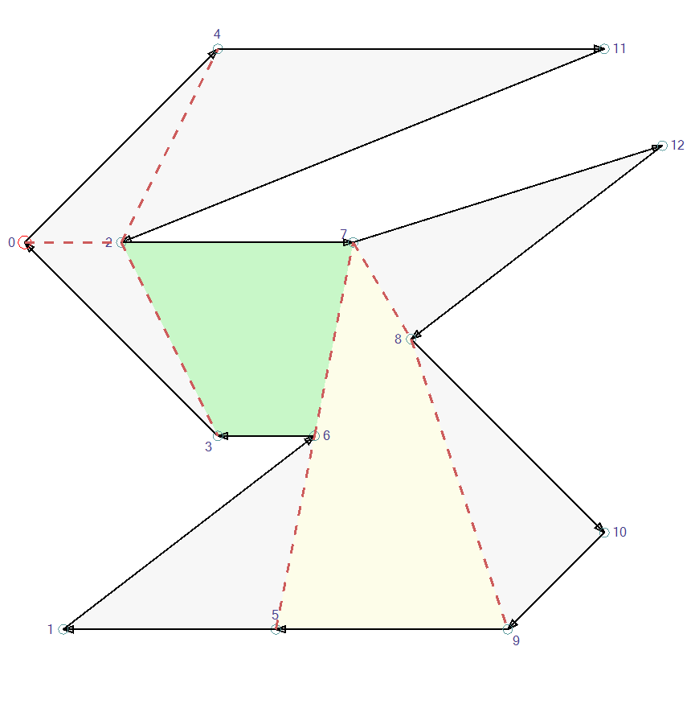

# Monotone Polygons

A monotone [polygon](Polygon.md) is intersected by any vertical line at maxium 2 times.

A mono monotone polygon has a single edge that connects the left-most and the right-most vertex. 
Call it the __base edge__.
The other vertices are either all above or all below the base edge.

After splitting a polygon via [Trapezoidation](Trapezoidation.md), the polygon consists of multiple mono monotone sub polygons.

## Triangulation of Mono Monotone Polygons

`MonotonePolygonTriangulator` starts at the end vertex of base edge. That is vertex 7 of polygon A and vertex 5 of polygon B.
*  Take the first three vertices.
*  Iterate to the end
  *  If the three active vertices do not form a clock wise triangle (the cross product of two triangle sides is >= 0)
    *  Push the oldest vertex on a stack and get a new vertex.
  *  Else
    *  Emit the triangle.
    *  Remove the middle vertex.
    *  If there is a vertex on the stack, pop it as oldest vertex.
    *  Otherwise get a new vertex.
    *  If there is no new vertex, the triangulation is complete.

 

Example A:
*  Start at 7, after initial pull: 7, 6, 3
*  (7, 6, 3) is a clock wise triangle, emit and remove 6.
*  Take the oldest (7) and newest (3) vertex and pull a new one (2)
*  (7, 3, 2) is a clock wise triangle

Example B:
*  Start at 5, after initial pull: 5, 6, 7
*  It's no clock wise triangle, so push 5 on the stack and take 8 as newest vertex.
*  (6, 7, 8) is a clock wise triangle, emit and remove 7.
*  There is (5) on the stack, use it as oldest
*  (5, 6, 8) is a clock wise triangle, emit and remove 6.
*  Take the oldest (5) and newest (8) vertex and pull a new one (9)
*  (5, 8, 9) is a clock wise triangle

A more complex example:
*  Start at 1, after initial pull: 1, 3, 4
*  (1, 3, 4) is no clock wise triangle, push 1 and consume 5
*  (3, 4, 5) is no clock wise triangle, push 3 and consume 6
*  (4, 5, 6) is a clock wise triangle. Emit, remove 5 and pop 3 as oldest
*  (3, 4, 6) is a clock wise triangle. Emit, remove 4 and pop 1 as oldest
*  (1, 3, 6) is no clock wise triangle, push 1 and consume 7
*  (3, 6, 7) is no clock wise triangle, push 3 and consume 8
*  (6, 7, 8) is a clock wise triangle. Emit, remove 7 and pop 3 as oldest
*  (3, 6, 8) is a clock wise triangle. Emit, remove 6 and pop 1 as oldest
*  (1, 3, 8) is a clock wise triangle. Emit, remove 3 and consume 9
*  (1, 8, 9) is no clock wise triangle, push 1 and consume 13
*  (8, 9, 13) is a clock wise triangle. Emit, remove 9 and pop 1 as oldest
*  (1, 8, 13) is a clock wise triangle. Emit, remove 8 and consume 16
*  (1, 13, 16) is a clock wise triangle. Emit and stop after last vertex.

## Optimization for triangles

A lot of splits produce sub polygons with 3 vertices, aka triangles.
The polygon split operation simply emits those directly instead of creating an additional sub polygon.
