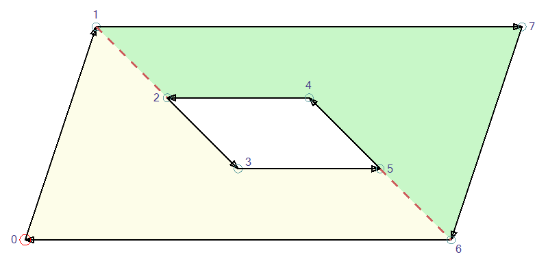
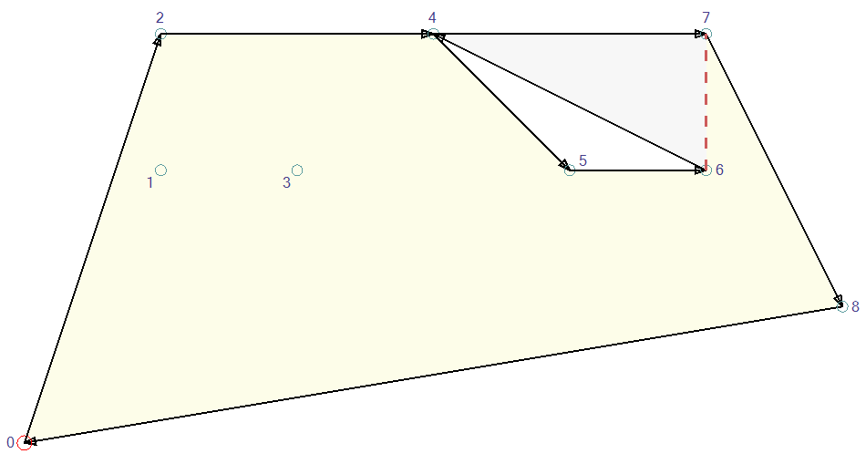

# Polygon

A polygon holds a number of vertices, connnected by edges, that enclose the polygon area. 
During the [Trapezoidation](Trapezoidation.md), the polygon is split into multiple [monotone polygons](Monotones.md).

A polygon can contain multiple polygon lines, called __sub polygons__.
The enclosed areas can be side by side or they define a hole inside another polygon area. 

Each edge is directed, the polygon area is always to the right of the edge. 
Hence the vertices are connected in clock wise order and holes in counter clock wise order.



## Generating a polygon from edges

The `PlanePolygonBuilder` creates a polygon from edges on a 3D plane. 
The vertices are first rotated to the plane normal and treated as 2D coordinates afterwards.

Very close vertices are considered the same to compensate rounding issues. That happens during the sort of the vertices.

Edges, that are not part of a closed polygon, are listed in `IPolygonLineDetector.UnclosedPolygons`. 
The top level call of the library, `PlanePolygonBuilder.Build`, simply ignores unclosed polygons.

## Splitting a polygon

The core operation for the polygon is to be splitted into multiple sub polygons. 
The initial polygon contains a single sub polygon: 0 1 2 5 4 3.
After the split between 2 and 3, there are 2 sub polygons: 0 1 2 3 and 2 5 4 3.
The vertices 2 and 3 belong to two sub polygons.

 

A vertex can be the target of multiple splits, so it will be part of more than 2 _sub polygons_.
There is always exactly one _sub polygon_, which contains both vertices of a split.
`FindCommonChain` selects the correct instance for both vertices.

### Handling of holes

A hole is a special case of a split, where the two vertices belong to different sub polygons. 
The `JoinHoleIntoPolygon` creates two edges, the first connects from 1 to 2 and the second connects from 2' to 1'.
The resulting single sub polygon is defined by 0 1 2 3 5 4 2' 1' 7 6.

The second split 5-6 splits that polygon again into two sub polygons: 0 1 2 3 5 6 and 1' 7 6 5 4 2'.

All splits that join a hole into another sub polygon are processed before any other split.

 

### Combination of splits and holes at a single vertex

For the next polygon, the [Trapezoidation](Trapezoidation.md) finds the splits 1-2, 2-4, 4-5 and 6-7.
The first split, 1-2, joins the hole into the polygon. 

The next split 2-4 can start either at __2__ or __2'__. 
Splitting along 2'-4 creates the correct sub polygons 1' 4 2' and 0 1 2 3 6 5 2' 4 8 7.
Splitting along 2-4 creates the wrong sub polygons 1' 4 2 3 6 5 2' and 0 1 2' 4 8 7. 
These sub polygons overlap each other, causing later processing errors.

`ChooseInstanceForSplit` chooses the correct vertex __2__ from _5 __2'__ 1'_ and _1 __2__ 3_. 
The new edge must be between the incoming edge and the outgoing edge, e.g. 2'-4 is between 2'-5 and 2'-1' but 2-4 is not between 2-1 and 2-3.


## Internal structure of a polygon

The 2D vertices are stored in the array `Polygon.Vertices`. The array is never modified.
The vertices must be sorted from left to right and then from bottom to top.

The vertex characteristics are stored in a `Polygon.VertexChain`. It can contain multiple instances of the same Vertex:
* The `VertexId`, which is the array index in `Polygon.Vertices`.
* The `Prev` and `Next` chain element in the current _sub polygon_.
* The `SubPolygonId` of the _vertex instance_.
* The `SameVertexChain` points to the next _vertex instance_ with the same `VertexId` but a different `SubPolygonId`.

The `vertexToChain` maps the vertex id to the index in the vertex `chain`.

The array `polygonStartIndices` contains the first chain element per sub polygon. 
The index in that array is the _sub polygon id_, which is used by `Polygon.SubPolygonIds` and `VertexChain.SubPolygonId`.
The vertex ids of a sub polygon are accessed by `Polygon.SubPolygonVertices(int subPolygonId)`.

## Crafting a polygon for unittests

Polygons can be created by `Polygon.Build`. 
The vertices must be sorted in X and then in Y direction and they're added in clockwise order.
The vertex id is the index in the `sortedVertices` array:
``` csharp
    var sortedVertices = new[]
    {
        new Vertex(0, 0),
        new Vertex(0, 1),
        new Vertex(1, 0),
        new Vertex(1, 1),
    };

    var polygon = Polygon.Build(sortedVertices)
        .AddVertices(0, 1, 3, 2)
        .Close();
```

A polygon can contains multiple side by side polygons or even holes. The vertices of a hole must be connected in counter-clockwise order:
``` csharp
    var polygon = Polygon.Build(sortedVertices)
        .AddVertices(1, 0, 2, 5, 8, 6)
        .ClosePartialPolygon()
        .AddVertices(3, 4, 7)
        .Close();
```

A fusion vertex can join two or more polygons in a common vertex. Those must be mentioned during `Close()`:

``` csharp
    var polygon = Polygon.Build(sortedVertices)
        .AddVertices(0, 1, 2)
        .ClosePartialPolygon()
        .AddVertices(2, 3, 4)
        .ClosePartialPolygon()
        .AddVertices(4, 5, 6)
        .Close(2, 4);
```

## Fusion vertices

Sometimes the very same vertex is used in two different sub polygons. The two polygons __fusion__ in that point. 
That can be two separate polygons or a hole in the polygon. The same two polygons can even touch multiple times.

 
 

### Fusion vertices during polygon building
The polygon outline must never cross itself.
During polygon construction, `FusionVerticesIntoChain` sorts the edges around each fusion point in clockwise order. 
A valid polygon order is 0 2 __5__ 1 3 __5__ 4 6 __5__ 7 8 __5__ 9 10.

 

But it would be invalid to use 0 2 __5__ 4 6 __5__ 1 3 __5__ 7 8 __5__ 9 10, because 2 5 4 crosses 3 5 7.


### Fusion vertices during Trapezoidation
The [Trapezoidation](Trapezoidation.md) will process a fusioned vertex multiple times. 
The processing order is "Join cusps", "Transitions", "Opening Cusps", which resembles the left to right processing of the vertices.



A bad example: consider processing the opening cusp 6-4-7 _before_ the transition 2-4-5: 
* Order of the active edges before 6-4-7 from high to low: 2-4 0-8.
* 4-6 is 4-6 is inserted and considered to be below 2-4 and above 0-8.
* Active edges after inserting the cusp: 2-4 4-7 4-6 0-8.
* The transition from 2-4 to 4-5 just replaces 2-4 by 4-5. (A transition expects to stay on the same level.)
* Active edges after transition: 4-5 4-7 4-6 0-8. => Corrupted.

> The problem effectively arises because the vertex 4 (left vertex of the inserted edge) is compared to edge 2-4. But it's neither above nor below.
>
> Processing all closing cusps and transitions before the insert operation ensures, that there is no active edge having the fusion vertex on the right.

Processing the transition before the opening cusp, edge 4-6 is compared to 4-5.
The comparer detects that both edges have the same left vertex and chooses the right vertex 6 for comparison.
