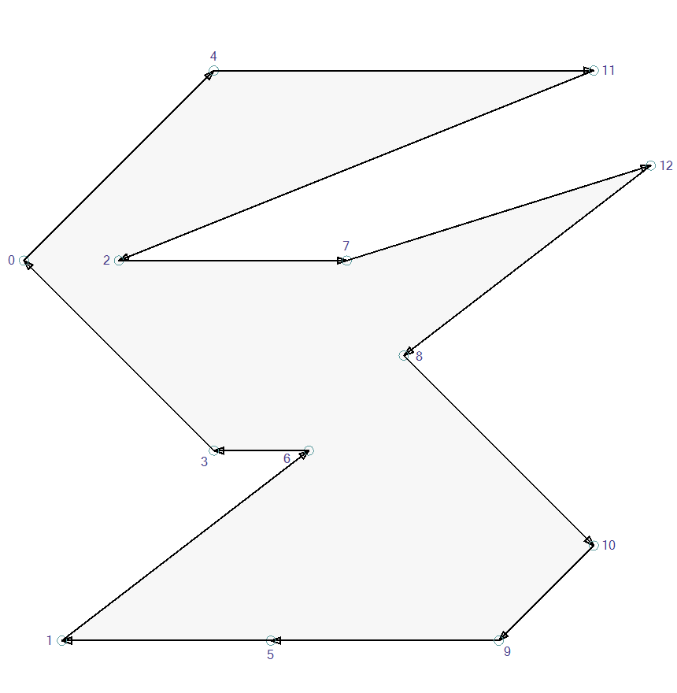
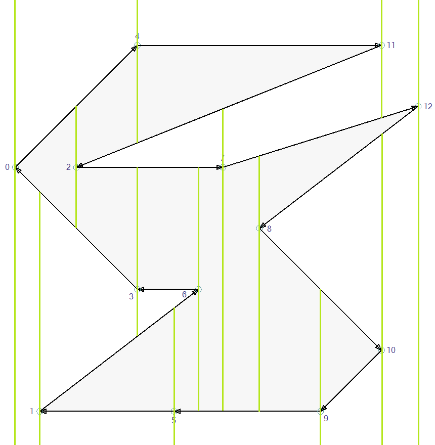
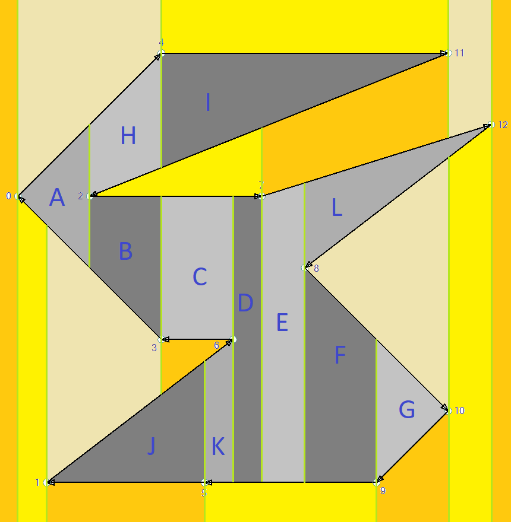

# Trapezoidation

The area of the [polygon](Polygon.md) can be splitted into multiple sub polygons, called [Monotone Polygons](Monotones.md).
Monotones can be splitted into triangles easily.

## The example polygon

## Names

These names distinguish between polygon elements and trapezoid elements:
* A __vertex__ is a polygon point.
* An __edge__ is a polygon line.
* A __corner__ is a trapezoid point.
* A __side__ is a trapezoid line.
* A __base__ is one of the two parallel trapezoid sides.

## Creating trapezoids

From each vertex, draw a line up to the next edge and down to the next edge. Imagine an upper infinity edge and a lower infinity edge.

__Characteristics of a trapezoid__:
* A trapezoid has 4 corners defining 4 sides.
* The left and the right base are vertical and parallel. They are not part of the polygon.
* Each base is defined by the X component of a vertex.
* The top and the bottom sides are part of a polygon edge.
* So each Trapezoid is defined by a left vertex, a right vertex, a top edge and a bottom edge.
* The area that's enclosed by the 4 sides is never crossed by an edge.
* Sometimes one trapezoid base has length 0, so it represents a triangle.

# Splitting the polygon

Here are all created trapezoids, each with a different color. The outside trapezoids are yellow, the inside trapezoids are grey.

The vertex of a trapezoid base may have 4 different positions, see `Trapezoidation.Trapezoid.Base`:
* It's equal to the upper corner of the base, e.g. Vertex 2 on the left side of Trapezoid __B__. (`UpperCorner`).
* It's equal to the lower corner of the base, e.g. Vertex 3 on the right side of Trapezoid __B__. (`LowerCorner`).
* It's in the middle of the edge, e.g. vertex 2 on the right side of Trapezoid __A__. (`TwoNeighbors`).
* The top and the bottom corner is the same, e.g. the left side of Trapezoid __A__. (`NoNeighbor`).

As no polygon edge passes _through_ the area of a trapezoid, it's safe to split the polygon along the two vertices.
The following rules detect if a split does not duplicate an existing edge:
1. One trapezoid base has two neighbors, i.e. the base is touched by a cusp of two polygon edges.
2. The vertex of one base is on the upper edge (`UpperCorner`) and the other is on the lower edge (`LowerCorner`).

Applying the rules to the example:
* Trapezoid __A__ has `TwoNeighbors` on the right base. Split from vertex 0 to 2.
* Trapezoid __B__ has `UpperCorner` on the left base and `LowerCorner` on the right base. Split from vertex 2 to 3.
* Trapezoid __C__ has `LowerCorner` on the left base and `LowerCorner` on the right base. No split.
* Trapezoid __D__ has `TwoNeighbors` on the left base. Split from vertex 6 to 7.
* Trapezoid __E__ has `TwoNeighbors` on the right base. Split from vertex 7 to 8.
* Trapezoid __F__ has `UpperCorner` on the left base and `LowerCorner` on the right base. Split from vertex 8 to 9.
* Trapezoid __G__ has `LowerCorner` on the left base and `NoNeighbor` on the right base. No split.
* Trapezoid __H__ has `LowerCorner` on the left base and `UpperCorner` on the right base. Split from vertex 2 to 4.
* Trapezoid __I__ has `UpperCorner` on the left base and `NoNeighbor` on the right base. No split.
* Trapezoid __J__ has `NoNeighbor` on the left base and `LowerCorner` on the right base. No split.
* Trapezoid __K__ has `LowerCorner` on the left base and `UpperCorner` on the right base. Split from vertex 5 to 6.
* Trapezoid __L__ has `LowerCorner` on the left base and `NoNeighbor` on the right base. No split.

The polygon with all possible splits:

And finally the [Monotone Polygons](Monotones.md), simple triangles are grey:

#  Assumptions for the Implementation

* The polygon edges are directed.
* The outer polygon is in _clock wise_ order, holes are in _counter clock wise_ order.
* Left of an edge is outside the polygon, right of an edge is inside of the polygon.
* The vertices are sorted from left to right and from bottom to top.

For the split detection, only the inside trapezoids are necessary.
For each X coordinate, there is exactly one inside trapezoid per edge.
As the vertices are traversed from left to right, the edge can be used to store and look up the trapezoid.

# Splitting programmatically.

The algorithm iterates over the vertices in X order (`Polygon.OrderedVertices`). 
Each vertex knows the incoming edge and the outgoing edge. 
That leaves us with 6 situations:
* Both neighbor vertices are larger, so it's a left pointing cusp. __(O)__
  * Vertex 0, prev is 3, next is 4. The incoming edge is the lower one, so we're entering the polygon area. __(1)__ `Trapezoid.EnterInsideBySplit`
  * Vertex 2, prev is 11, next is 7. The incoming edge is the upper one, so we're leaving the polygon area. __(2)__ `Trapezoid.LeaveInsideBySplit`
* One neighbor vertex is larger, the other one is smaller, so the polygon transitions from one edge to the next. __(T)__
  * Vertex 5, prev is 9 (larger), next is 1 (smaller). The edges are right to left, the polygon area is above __(3)__. `Trapezoid.TransitionOnLowerEdge`
  * Vertex 4, prev is 0 (smaller), next is 11 (larger). The edges are left to right, the polygon area is below __(4)__. `Trapezoid.TransitionOnUpperEdge`
* Both neighbor vertices are smaller, so it's a right pointing cusp. __(J)__
  * Vertex 6, prev is 1, next is 3. The incoming edge is the lower one, so we're entering the polygon area. __(5)__ `Trapezoid.EnterInsideByJoin`
  * Vertex 10, prev is 8, next is 9. The incoming edge is the upper one, so we're leaving the polygon area. __(6)__ `Trapezoid.LeaveInsideByJoin`

While iterating over the vertices, there is a list `Trapezoidation.activeEdges`, sorted from bottom to top.
That structure allows to find the previous (lower) and the next (upper) of an edge.
Each pair of active edges points to one trapezoid, one as upper side and one as lower side.
E.g. before we process vertex 6, the active edges are 5-9(__K__), 1-6(__K__), 3-6(__C__), 2-7(__C__), 2-11(__I__), 4-11(__I__). 
* Situation __(O)__ first compares the two edges to distinguish situation __(1)__ and __(2)__. 
  * Insert the pair in `activeEdges`.
  * Situation __(1)__ creates one trapezoid like __A__ or __J__. The two active edges point to the new trapezoid. The left base is set to `NoNeighbor`.
  * In Situation __(2)__ there is an edge above the upper and one below the lower, both point to the left trapezoid (__A__)
    * Close the trapezoid to the left and set the right edge to `TwoNeighbors`.
    * Create a trapezoid between upper and upper.above (__H__).
    * Create a trapezoid between lower and lower.below (__B__).
* During a transition __(T)__, the previous edge is part of `activeEdges` and that points to a trapezoid.
  * Close the old trapezoid and set the right base to `UpperCorner` or `LowerCorner`, depending on if the edge is pointing left or right.
  * Create a new trapezoid with the new active edge and the peer edge.
  * Replace the active edge with the new active edge.
  * e.g. Transition at point 5: close __J__ with `LowerCorner` as right base. 
    Create __K__ with the new edge 5-9 as lower and the above of 1-5, which is 1-6. 
    In `activeEdges`, replace 1-5 with 5-9.
* Situation __(J)__ joines two existing active edges. Both must have the same right vertex. If the lower edge direction is left to right, it's situation __(5)__.
  * In Situation __(5)__:
    * Close the trapezoid of the upper edge (__C__) with `LowerCorner` as right base.
    * Close the trapezoid of the lower edge (__K__) with `UpperCorner` as right base.
    * Create a new trapezoid between upper.Above and lower.Below. Set the left base to `TwoNeighbors`.
    * Remove the two edges from `activeEdges`.
  * In Situation __(6)__, the upper edge and lower edge both point to the same trapezoid (__G__). 
    Set the right base to `NoNeighbor` and remove both edges from `activeEdges`.

# Vertical polygon edges

The upper vertex of the polygon edge is considered to be "slightly right" to the lower point of the vertical polygon edge. 
Thats why the points are sorted not only by their X coordinate but also by the Y coordinate.

The vertical _polygon edge_ is treated as a horizontal _trapezoid side_.

# Performance considerations

The `activeEdges` is implemented as a red black tree. That's a self-balancing binary tree.

The number of insert operations can be reduced:
* Edges are inserted pairwise. The first edge is the insert position for the second edge, as it's exactly above the first edge.
* The insert operation returns the internal node as `IOrderedNode<T>`. That's reused for replace and remove operations.
* A node can be replaced with different data instead of two remove/insert operations.
* The default delete operation of a red black tree replaces the data of a node. 
  This implementation replaces the node itself. Thats important because somebody might hold a reference to the "replace with" node.
* For lookup, only the Prev() and Next() is required. There is no lookup by data.

To find the previous edge during a Transition __(T)__ or both joining edges of a right pointing cusp __(J)__, 
all active edges are stored in a hashseet with the right vertex as key.
(Actually it uses the index of the polygon chain for that vertex, as the same vertex may be used by multiple sub polygons).

# Comparing edges

Edges are compared by `Trapezoidation.EdgeComparer` for an opening cusp and during the insert operation in `activeEdges`.
* For an opening cusp, the left point is the same.
* The slow path calculates the Y of one edge at the X of the right point of the other edge. 
  This implies that the edges of the polygon never intersect.
* An edge may be vertical. To avoid rounding issues with high slopes, the point is calculated for the edge with the larger X span.
* The implementation avoids calculation wherever it's unnecessary. 
  E.g. the left point is the same and the right1.Y is above and right2.Y is below left.Y.
